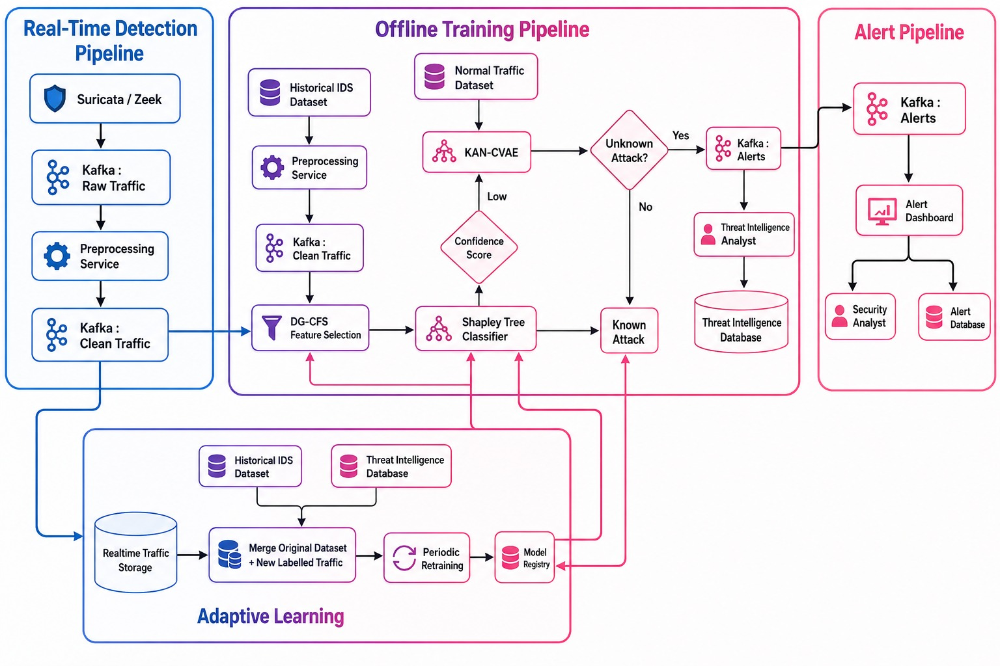

# 🛡️ IR-IDS 


### A Network-Based Intrusion Detection System Based on Causal Feature Selection and Explainable Model Optimization

### Using Apache Kafka • Docker • Machine Learning • Explainable AI • Threat Intelligence


---

### 🚀 High-Performance • Scalable • Explainable • Adaptive Cyber Security Platform

</div>

---

# 📚 Table of Contents

- [Overview](#-overview)
- [Problem Statement](#-problem-statement)
- [Project Objectives](#-project-objectives)
- [Key Features](#-key-features)
- [System Architecture](#-system-architecture)
- [Real-Time Detection Pipeline](#-real-time-detection-pipeline)
- [Offline Training Pipeline](#-offline-training-pipeline)
- [Threat Intelligence Pipeline](#-threat-intelligence-pipeline)
- [Adaptive Learning Pipeline](#-adaptive-learning-pipeline)
- [Alert Pipeline](#-alert-pipeline)
- [Complete Data Flow](#-complete-data-flow)
- [Kafka Topics](#-kafka-topics)
- [Microservice Architecture](#-microservice-architecture)
- [Technology Stack](#-technology-stack)
- [Repository Structure](#-repository-structure)
- [Installation Guide](#-installation-guide)
- [Docker Deployment](#-docker-deployment)
- [Running the Project](#-running-the-project)
- [Machine Learning Pipeline](#-machine-learning-pipeline)
- [Datasets](#-datasets)
- [Roadmap](#-roadmap)
- [Contributors](#-contributors)
- [License](#-license)

---

# 📖 Overview

**IR-IDS (Intelligent Real-Time Intrusion Detection System)** is a distributed, event-driven Network Intrusion Detection System designed to identify both known and unknown cyber attacks in real time.

Unlike conventional IDS solutions that rely solely on static signatures or isolated machine learning models, IR-IDS combines:

- Apache Kafka based real-time streaming
- Distributed microservice architecture
- Explainable Artificial Intelligence (XAI)
- Causal Feature Selection
- Machine Learning based attack classification
- Unknown attack detection
- Threat Intelligence integration
- Adaptive model retraining

The platform is designed to process massive volumes of network traffic with minimal latency while remaining scalable, modular, and production-ready.

---

# ❗ Problem Statement

Modern enterprise networks generate millions of packets every hour.

Traditional Intrusion Detection Systems suffer from several limitations:

- Signature-based detection cannot identify zero-day attacks.
- Large datasets introduce high computational overhead.
- Machine learning models often lack explainability.
- Static models degrade over time as new attack patterns emerge.
- Existing IDS platforms rarely integrate threat intelligence or adaptive retraining.

These challenges motivate the development of an intelligent, scalable, and continuously learning intrusion detection platform.

---

# 🎯 Project Objectives

The primary objectives of IR-IDS are:

- Detect malicious network traffic in real time.
- Process high-volume network streams using Apache Kafka.
- Build a scalable microservice-based IDS architecture.
- Perform automated preprocessing and validation.
- Reduce feature dimensionality using causal feature selection.
- Train explainable machine learning models.
- Detect previously unseen cyber attacks.
- Integrate Threat Intelligence into the detection workflow.
- Generate real-time alerts for analysts.
- Continuously improve detection through adaptive learning.

---

# 💡 Why IR-IDS?

Traditional IDS solutions are reactive.

IR-IDS is designed to be:

- **Real-Time** — Processes live network traffic continuously.
- **Scalable** — Kafka-based distributed architecture.
- **Explainable** — Decisions can be interpreted by analysts.
- **Adaptive** — Learns from newly discovered attacks.
- **Extensible** — Modular microservice architecture allows easy expansion.
- **Production Ready** — Containerized using Docker.

---

# 🌟 Key Features

## ⚡ High-Speed Streaming

- Apache Kafka Event Streaming
- Distributed Message Queues
- Asynchronous Processing
- High Throughput Architecture

---

## 🛡️ Real-Time Intrusion Detection

- Live Traffic Processing
- Continuous Packet Analysis
- Low-Latency Detection
- Event-Driven Processing

---

## 🧹 Intelligent Data Preprocessing

- Schema Validation
- Missing Value Handling
- Data Cleaning
- Normalization
- Feature Formatting
- Invalid Record Detection

---

## 🧠 Explainable Machine Learning

- DG-CFS Feature Selection
- Shapley Tree Classification
- Explainable Predictions
- Confidence Estimation

---

## 🚨 Unknown Attack Detection

- KAN-CVAE based anomaly detection
- Confidence Score Analysis
- Zero-Day Attack Detection
- Novel Threat Discovery

---

## 🌐 Threat Intelligence

- Threat Intelligence Database
- IOC Management
- Analyst Feedback Loop
- Knowledge Enrichment

---

## 🔄 Adaptive Learning

- Continuous Dataset Collection
- Model Retraining
- Versioned Model Registry
- Incremental Learning

---

## 📊 Alert Management

- Kafka Alert Streaming
- Security Dashboard
- Incident Database
- Analyst Notification

---

# 🏆 Highlights

✔ Apache Kafka Streaming Platform

✔ Dockerized Microservices

✔ Distributed Architecture

✔ Explainable AI

✔ Causal Feature Selection

✔ Unknown Attack Detection

✔ Threat Intelligence Integration

✔ Adaptive Learning

✔ Model Registry

✔ High Throughput

✔ Enterprise Ready

✔ Modular Design

✔ Extensible Framework

✔ Research-Oriented Architecture

✔ Production Deployment Support

---

# 🏗️ System Architecture

The IR-IDS platform consists of four tightly integrated pipelines:

1. **Real-Time Detection Pipeline**
2. **Offline Training Pipeline**
3. **Threat Intelligence Pipeline**
4. **Adaptive Learning Pipeline**

Each pipeline communicates asynchronously through Apache Kafka, enabling scalable and fault-tolerant data processing while maintaining high throughput and low latency.

<p align="center">

</p>

---

# ⚡ Real-Time Detection Pipeline

The **Real-Time Detection Pipeline** is responsible for continuously monitoring
live network traffic and identifying malicious activities with minimal latency.

Unlike traditional offline Intrusion Detection Systems (IDS), IR-IDS processes
network packets as streaming events through Apache Kafka, enabling scalable,
fault-tolerant and asynchronous data processing.

---

## Workflow

```text
Network Traffic
       │
       ▼
Packet Capture
(Suricata / Zeek / PCAP)
       │
       ▼
Kafka Producer
       │
       ▼
Kafka Topic
(raw-traffic)
       │
       ▼
Preprocessing Service
       │
       ▼
Kafka Topic
(clean-traffic)
       │
       ▼
Real-Time Storage
```

---

## Stage 1 — Network Traffic Collection

The pipeline begins by capturing live network traffic from enterprise
networks.

Traffic sources include:

- Enterprise LAN
- Cloud Infrastructure
- IoT Devices
- Data Centers
- Firewalls
- Routers
- IDS Sensors

Supported packet capture engines

- Suricata
- Zeek (Bro)
- PCAP
- NetFlow
- Custom Packet Collectors

---

## Stage 2 — Kafka Ingestion Service

The ingestion microservice converts captured packets into structured records
and publishes them into Apache Kafka.

Responsibilities

- Read incoming packets
- Convert packets into JSON
- Serialize records
- Publish records asynchronously
- Handle high-volume streaming
- Fault-tolerant message publishing

Output Topic

```text
raw-traffic
```

---

## Stage 3 — Preprocessing Service

The preprocessing microservice validates and cleans incoming traffic before it
is consumed by downstream machine learning services.

Responsibilities

✔ Missing value handling

✔ Null replacement

✔ Infinite value replacement

✔ Feature normalization

✔ Schema validation

✔ Invalid record removal

✔ Data formatting

✔ Label normalization

✔ Data quality assurance

Output Topic

```text
clean-traffic
```

---

## Stage 4 — Real-Time Storage

Cleaned traffic is stored for:

- Future model retraining
- Threat investigation
- Historical analysis
- Adaptive learning
- Data auditing

---

# 🧠 Offline Training Pipeline

Unlike the Real-Time Detection Pipeline, the Offline Training Pipeline focuses
on building and continuously improving machine learning models.

The pipeline operates on historical datasets together with previously captured
network traffic.

---

## Workflow

```text
Historical Dataset

        │

        ▼

Preprocessing

        │

        ▼

DG-CFS Feature Selection

        │

        ▼

Train/Test Split

        │

        ▼

Shapley Tree Classifier

        │

        ▼

Known Attack Detection

        │

        ▼

Confidence Score Evaluation

        │

        ▼

KAN-CVAE

        │

        ▼

Unknown Attack Detection
```

---

## Historical Dataset

Training data may include:

- CICIDS2017
- CICIDS2018
- CSE-CIC-IDS2018
- UNSW-NB15
- TON-IoT
- Custom Enterprise Traffic

---

## DG-CFS Feature Selection

The **DG-CFS (Dynamic Graph Causal Feature Selection)** module identifies the
most relevant network features while eliminating redundant attributes.

Advantages

- Lower computational cost
- Reduced memory usage
- Faster inference
- Better generalization
- Improved explainability

---

## Train/Test Split

Selected features are divided into:

- Training Dataset
- Validation Dataset
- Testing Dataset

This enables unbiased model evaluation.

---

## Shapley Tree Classifier

The primary classifier is an Explainable AI model based on decision trees.

Responsibilities

- Known attack classification
- Explainable predictions
- Feature importance estimation
- Confidence score generation

Advantages

- High interpretability
- Fast inference
- Suitable for security analysts

---

## Confidence Score Evaluation

Every prediction is assigned a confidence score.

Possible outcomes

### High Confidence

Known attack

↓

Generate Alert

### Low Confidence

Potential Unknown Attack

↓

Forward to KAN-CVAE

---

## KAN-CVAE

KAN-CVAE is responsible for detecting attacks never seen during training.

Responsibilities

- Novel attack detection
- Zero-day attack identification
- Behavioural anomaly detection
- Latent representation learning

Output

```text
Unknown Attack
```

---

# 🌐 Threat Intelligence Pipeline

The Threat Intelligence Pipeline enriches unknown attack information using
human expertise and security knowledge.

---

## Workflow

```text
Unknown Attack

      │

      ▼

Threat Intelligence Analyst

      │

      ▼

Threat Intelligence Database

      │

      ▼

Adaptive Learning
```

---

## Threat Intelligence Analyst

Security analysts investigate unknown attacks by examining

- Attack signatures
- Indicators of Compromise (IOC)
- Malware behaviour
- Network behaviour
- MITRE ATT&CK Mapping
- Tactics
- Techniques
- Procedures

---

## Threat Intelligence Database

Validated intelligence is stored in a centralized repository.

Contents

- Attack Signatures
- IOC Database
- Malware Hashes
- IP Reputation
- Domain Reputation
- Threat Reports
- Behavioral Indicators

The Threat Intelligence Database improves future detection performance.

---

# 🔄 Adaptive Learning Pipeline

Traditional IDS models become outdated as new attacks emerge.

IR-IDS overcomes this problem using Adaptive Learning.

---

## Workflow

```text
Realtime Storage

        +

Historical Dataset

        │

        ▼

Merged Dataset

        │

        ▼

Model Retraining

        │

        ▼

Model Registry

        │

        ▼

Updated Detection Model
```

---

## Adaptive Learning Process

The adaptive learning engine periodically

- Collects newly labelled traffic
- Merges historical and recent data
- Retrains the detection model
- Evaluates performance
- Stores the best model
- Deploys the updated classifier

Benefits

✔ Improved Accuracy

✔ Reduced Model Drift

✔ Continuous Learning

✔ Better Unknown Attack Detection

---

# 🚨 Alert Pipeline

Whenever malicious activity is detected, alerts are generated immediately.

---

## Workflow

```text
Classification Results

        │

        ▼

Kafka Topic

(alerts)

        │

        ▼

Alert Dashboard

        │

        ▼

Security Analyst
```

---

## Alert Information

Each alert contains

- Timestamp
- Source IP
- Destination IP
- Attack Category
- Severity Level
- Confidence Score
- Prediction Label
- Threat Intelligence Reference
- Suggested Mitigation

---

## Alert Severity

| Severity | Description |
|----------|-------------|
| Low | Suspicious activity |
| Medium | Potential intrusion |
| High | Confirmed attack |
| Critical | Severe enterprise threat |

---

# 🌊 Complete End-to-End Data Flow

```text
                Historical Dataset
                        │
                        ▼
                Feature Engineering
                        │
                        ▼
               DG-CFS Feature Selection
                        │
                        ▼
              Shapley Tree Classifier
                        │
            ┌───────────┴───────────┐
            │                       │
            ▼                       ▼
     Known Attack          Confidence Score
                                    │
                                    ▼
                              KAN-CVAE
                                    │
                                    ▼
                           Unknown Attack
                                    │
                                    ▼
                     Threat Intelligence Database
                                    │
                                    ▼
                           Adaptive Learning
                                    ▲
                                    │
Realtime Traffic → Kafka → Preprocessing → Clean Traffic
                                    │
                                    ▼
                            Classification
                                    │
                                    ▼
                              Kafka Alerts
                                    │
                                    ▼
                           Security Dashboard
```

---

# 📡 Apache Kafka Topics

| Topic | Purpose | Producer | Consumer |
|--------|----------|----------|----------|
| `raw-traffic` | Raw network traffic | Ingestion Service | Preprocessing Service |
| `clean-traffic` | Cleaned traffic | Preprocessing | Feature Selection |
| `selected-features` | Optimized feature set | Feature Selection | Classification |
| `classification-results` | Prediction output | Classification | Alert Service |
| `alerts` | Security alerts | Alert Service | Dashboard |
| `unknown-traffic` *(Future)* | Unknown attacks | KAN-CVAE | Threat Intelligence |
| `threat-intelligence` *(Future)* | Intelligence updates | Threat Intelligence | Adaptive Learning |
| `model-updates` *(Future)* | Updated models | Adaptive Learning | Classification |

---

# 🧩 Microservice Architecture

IR-IDS follows a **distributed event-driven microservice architecture**, where each component performs a dedicated task and communicates asynchronously through Apache Kafka.

This modular design enables scalability, fault tolerance, and independent deployment of services.

---

## 🛰️ Ingestion Service

### Purpose

The Ingestion Service is responsible for collecting network traffic and publishing it to Apache Kafka.

### Responsibilities

- Read CSV datasets or live packet streams
- Parse network traffic records
- Convert data into JSON format
- Publish traffic into Kafka
- Handle streaming data efficiently
- Support high-throughput ingestion

### Input

- CSV Dataset
- PCAP Files *(Future)*
- Live Network Packets *(Future)*

### Output Kafka Topic

```text
raw-traffic
```

---

## 🧹 Preprocessing Service

The preprocessing service ensures all incoming traffic is validated and standardized before machine learning.

### Responsibilities

- Data Validation
- Missing Value Handling
- Remove Corrupted Records
- Normalize Labels
- Feature Formatting
- Null Replacement
- Infinite Value Replacement
- Schema Validation
- Logging
- Performance Monitoring

### Input Topic

```text
raw-traffic
```

### Output Topic

```text
clean-traffic
```

---

## 🎯 Feature Selection Service

The Feature Selection Service reduces dimensionality while preserving informative network attributes.

### Algorithm

DG-CFS

(Dynamic Graph Causal Feature Selection)

### Responsibilities

- Remove redundant features
- Preserve causal features
- Improve model performance
- Reduce computational cost
- Improve explainability

Input Topic

```text
clean-traffic
```

Output Topic

```text
selected-features
```

---

## 🤖 Classification Service

The Classification Service predicts the attack category using trained machine learning models.

### Responsibilities

- Load trained models
- Predict attack labels
- Estimate confidence score
- Forward unknown attacks
- Publish predictions

Input Topic

```text
selected-features
```

Output Topic

```text
classification-results
```

---

## 🚨 Alert Service

The Alert Service converts prediction results into actionable security alerts.

### Responsibilities

- Generate alerts
- Assign severity
- Store incidents
- Publish notifications
- Notify dashboard

Input Topic

```text
classification-results
```

Output Topic

```text
alerts
```

---

## 🌐 Threat Intelligence Service *(Future)*

This service enriches detected threats with external intelligence.

Responsibilities

- IOC Lookup
- Threat Feed Integration
- MITRE ATT&CK Mapping
- Malware Intelligence
- Threat Database Updates

---

## 🔄 Adaptive Learning Service *(Future)*

Responsibilities

- Collect new labelled traffic
- Merge historical datasets
- Retrain models
- Evaluate accuracy
- Register improved models

---

# ⚙️ Technology Stack

## Programming Languages

- Python 3.13

---

## Streaming Platform

- Apache Kafka

---

## Containerization

- Docker
- Docker Compose

---

## Data Processing

- Pandas
- NumPy

---

## Machine Learning

- Scikit-learn

Future

- XGBoost
- LightGBM
- CatBoost

---

## Deep Learning

Future

- TensorFlow
- Keras
- PyTorch

---

## Explainable AI

- SHAP
- Feature Importance
- Shapley Values

---

## Development Tools

- Git
- GitHub
- VS Code

---

## Operating Systems

- Windows
- Linux

---

# 📂 Repository Structure

```text
IR-IDS-PROJECT-

│
├── docker/
│   ├── docker-compose.yml
│   └── Dockerfile
│
├── docs/
│   └── architecture.png
│
├── datasets/
│
├── models/
│
├── kafka/
│
├── services/
│
│   ├── ingestion/
│   │     ├── csv_reader.py
│   │     ├── kafka_producer.py
│   │     └── config.py
│   │
│   ├── preprocessing/
│   │     ├── cleaner.py
│   │     ├── config.py
│   │     ├── kafka_consumer.py
│   │     ├── kafka_producer.py
│   │     ├── logger.py
│   │     ├── requirements.txt
│   │     ├── schema.py
│   │     ├── service.py
│   │     ├── validator.py
│   │     └── test_kafka.py
│   │
│   ├── feature_selection/
│   │
│   ├── classification/
│   │
│   ├── threat_intelligence/
│   │
│   ├── adaptive_learning/
│   │
│   └── alert_service/
│
├── README.md
├── LICENSE
└── .gitignore
```

---

# 💻 Installation Guide

## Clone Repository

```bash
git clone https://github.com/Revaan23/IR-IDS-PROJECT-.git

cd IR-IDS-PROJECT-
```

---

## Create Virtual Environment

Windows

```bash
python -m venv .venv

.venv\Scripts\activate
```

Linux

```bash
python3 -m venv .venv

source .venv/bin/activate
```

---

## Install Dependencies

### Preprocessing Service

```bash
cd services/preprocessing

pip install -r requirements.txt
```

### Ingestion Service

```bash
cd ../ingestion

pip install -r requirements.txt
```

---

# 🐳 Docker Deployment

Move into docker folder

```bash
cd docker
```

Start Kafka

```bash
docker compose up -d
```

Verify containers

```bash
docker ps
```

Expected Containers

- Kafka Broker
- Kafka UI

---

## Kafka UI

Open

```
http://localhost:8080
```

---

## Kafka Broker

```
localhost:9092
```

---

# ▶️ Running the Project

## Step 1

Start Docker

```bash
docker compose up -d
```

---

## Step 2

Run Ingestion Service

```bash
cd services/ingestion

python csv_reader.py
```

---

## Step 3

Run Preprocessing Service

```bash
cd services/preprocessing

python service.py
```

---

## Future Execution Flow

```text
Ingestion

↓

Preprocessing

↓

Feature Selection

↓

Classification

↓

Threat Intelligence

↓

Adaptive Learning

↓

Alert Service
```

---

# 📊 Current Progress

| Module | Status |
|---------|--------|
| Docker Infrastructure | ✅ Completed |
| Kafka Integration | ✅ Completed |
| Kafka UI | ✅ Completed |
| CSV Ingestion | ✅ Completed |
| Data Validation | ✅ Completed |
| Data Cleaning | ✅ Completed |
| Kafka Producer | ✅ Completed |
| Kafka Consumer | ✅ Completed |
| Logging System | ✅ Completed |
| Feature Selection | 🚧 In Progress |
| Model Training | ⏳ Pending |
| Classification | ⏳ Pending |
| Threat Intelligence | ⏳ Planned |
| Adaptive Learning | ⏳ Planned |
| Dashboard | ⏳ Planned |

---

# 🤖 Machine Learning Pipeline

IR-IDS employs a hybrid machine learning framework that combines feature selection,
explainable classification, unknown attack detection, and adaptive retraining.

---

## Pipeline Overview

```text
Historical Dataset
        │
        ▼
Data Preprocessing
        │
        ▼
Feature Engineering
        │
        ▼
DG-CFS Feature Selection
        │
        ▼
Train / Validation / Test Split
        │
        ▼
Shapley Tree Classifier
        │
        ▼
Confidence Score Evaluation
        │
 ┌──────┴─────────┐
 │                │
 ▼                ▼
Known Attack   Unknown Attack
 Detection        Detection
                    │
                    ▼
               KAN-CVAE
                    │
                    ▼
          Threat Intelligence
                    │
                    ▼
          Adaptive Learning
                    │
                    ▼
            Updated Model
```

---

# 🧠 Machine Learning Components

## 1️⃣ Data Preprocessing

The preprocessing stage prepares raw traffic for downstream machine learning tasks.

Operations include:

- Data validation
- Missing value handling
- Null replacement
- Infinite value replacement
- Label normalization
- Feature normalization
- Schema validation

---

## 2️⃣ Feature Selection

Algorithm

**DG-CFS**

(Dynamic Graph Causal Feature Selection)

Purpose

- Remove redundant features
- Preserve causal relationships
- Improve accuracy
- Reduce training time
- Reduce memory usage

---

## 3️⃣ Explainable Classification

Model

**Shapley Tree Classifier**

Capabilities

- Multi-class attack classification
- Confidence score estimation
- Explainable predictions
- Feature importance analysis

---

## 4️⃣ Unknown Attack Detection

Model

**KAN-CVAE**

(Kolmogorov-Arnold Network + Conditional Variational Autoencoder)

Purpose

- Detect zero-day attacks
- Identify unseen attack patterns
- Behavioural anomaly detection
- Latent feature learning

---

## 5️⃣ Adaptive Learning

Adaptive learning continuously improves the IDS using newly labelled traffic.

Workflow

- Merge historical datasets
- Include verified unknown attacks
- Retrain models
- Register best-performing models
- Deploy updated models

---

# 📊 Supported Datasets

Current Development Dataset

- Historical Network Traffic Dataset

Future Supported Datasets

- CICIDS2017
- CICIDS2018
- CSE-CIC-IDS2018
- UNSW-NB15
- TON-IoT
- BoT-IoT
- NSL-KDD

---

# 📈 Performance Goals

The architecture has been designed with the following objectives.

| Metric | Target |
|---------|--------|
| Throughput | High-Speed Kafka Streaming |
| Processing Latency | Low Latency |
| Detection Accuracy | >95% (Target) |
| Unknown Attack Detection | Supported |
| Scalability | Horizontal Scaling |
| Availability | High Availability |
| Fault Tolerance | Kafka Based |
| Explainability | Integrated |

---

# 🛡️ Security Features

IR-IDS provides several enterprise-grade security capabilities.

### Network Monitoring

- Continuous Traffic Analysis
- Real-Time Packet Processing

### Intrusion Detection

- Known Attack Detection
- Unknown Attack Detection

### Threat Intelligence

- IOC Database
- Threat Enrichment
- Analyst Feedback

### Explainability

- Feature Importance
- Confidence Scores
- Explainable Predictions

### Adaptive Learning

- Continuous Retraining
- Model Versioning
- Performance Monitoring

---

# 🚀 Future Enhancements

The following improvements are planned for future releases.

## Machine Learning

- Ensemble Learning
- Federated Learning
- Graph Neural Networks
- Transformer-Based IDS

---

## Infrastructure

- Kubernetes Deployment
- Multi-Broker Kafka Cluster
- Redis Cache
- Load Balancing

---

## Monitoring

- Grafana Dashboard
- Prometheus Metrics
- ELK Stack Integration
- OpenTelemetry

---

## Threat Intelligence

- VirusTotal Integration
- AbuseIPDB Integration
- AlienVault OTX
- MISP Integration

---

## Dashboard

- Real-Time Analytics
- Threat Visualization
- Interactive Reports
- Security Heatmaps

---

# 🗺️ Development Roadmap

## Phase 1 — Infrastructure

- [x] Project Initialization
- [x] Docker Environment
- [x] Apache Kafka Setup
- [x] Kafka UI
- [x] CSV Ingestion
- [x] Kafka Producer
- [x] Kafka Consumer

---

## Phase 2 — Data Processing

- [x] Data Validation
- [x] Data Cleaning
- [x] Schema Validation
- [x] Logging Framework
- [x] Preprocessing Service

---

## Phase 3 — Machine Learning

- [ ] Feature Engineering
- [ ] DG-CFS Implementation
- [ ] Model Training
- [ ] Model Evaluation
- [ ] Model Registry

---

## Phase 4 — Detection

- [ ] Classification Service
- [ ] Confidence Estimation
- [ ] Unknown Attack Detection
- [ ] Threat Intelligence
- [ ] Adaptive Learning

---

## Phase 5 — Visualization

- [ ] Alert Dashboard
- [ ] Threat Dashboard
- [ ] Performance Dashboard
- [ ] System Monitoring

---

# 📚 References

This project is inspired by research in:

- Network Intrusion Detection Systems
- Explainable Artificial Intelligence (XAI)
- Apache Kafka Event Streaming
- Distributed Microservices
- Threat Intelligence Platforms
- Adaptive Machine Learning

---

# 🤝 Contribution Guidelines

We welcome contributions to improve IR-IDS.

To contribute:

1. Fork the repository.
2. Create a feature branch.
3. Implement your changes.
4. Commit with meaningful messages.
5. Push to your fork.
6. Open a Pull Request.

Please ensure that:

- Code follows project conventions.
- New features include documentation.
- Existing functionality is not broken.
- Changes are tested before submission.

---

# 👨‍💻 Contributors

| Name | Role | Responsibilities |
|------|------|------------------|
| **Revaan J R** | Team Lead | System Architecture, Kafka Integration, Backend Development, Project Coordination |
| **Member 2** | Machine Learning Engineer | Feature Selection, Model Training, Evaluation |
| **Member 3** | AI Engineer | Unknown Attack Detection, Adaptive Learning |
| **Member 4** | Full Stack Developer | Dashboard, Alert Service, Visualization |

---

# 📜 License

This project is developed as part of a **Bachelor of Technology (Artificial Intelligence and Data Science)** Final Year Project.

Licensed under the **MIT License**.

See the `LICENSE` file for more details.

---

# 🙏 Acknowledgements

The authors would like to acknowledge:

- Apache Kafka
- Docker
- Python Community
- Scikit-learn
- TensorFlow
- Pandas
- NumPy
- Open Source Community

for providing the tools and technologies that made this project possible.

---

# ⭐ Support the Project

If you found this project useful:

⭐ Star the repository

🍴 Fork the repository

🐛 Report issues

💡 Suggest new features

🤝 Contribute to development

---

<div align="center">

## 🛡️ IR-IDS

### Intelligent Real-Time Intrusion Detection System

**Building Intelligent, Explainable and Adaptive Cyber Defense Systems**

Made with ❤️ by the **IR-IDS Development Team**

</div>

